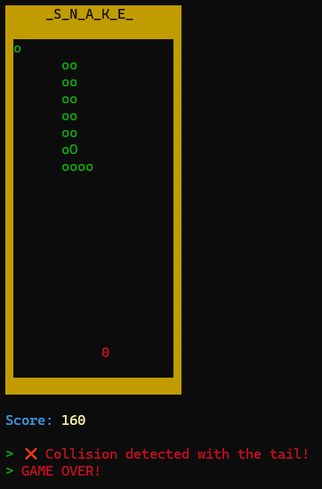

# c-games

Trabalho solicitado pelo professor de Alfredo Boente durante a matéria Programação Estruturada da faculdade.

## `_S_N_A_K_E_`



### Compilando o jogo via gcc

> A partir da pasta _s_n_a_k_e_

```bash
gcc -o snake.exe .\app.c ..\tools\terminal_colors\terminal_colors.c
```

---

## JAN-KEN-PO

---

## Jogo da Velha
